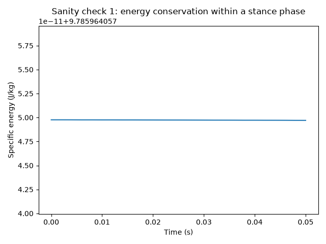
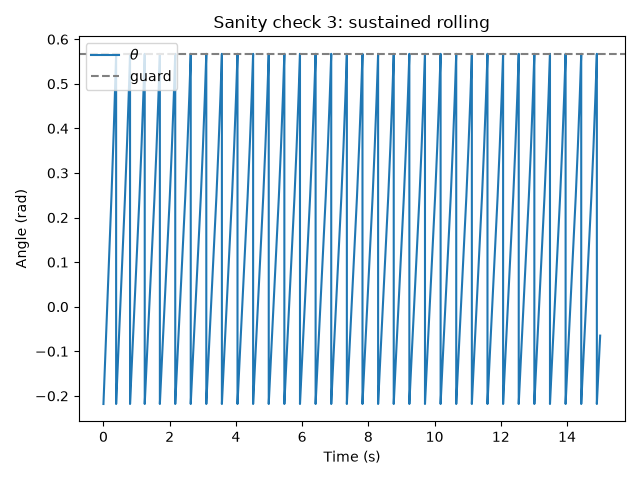
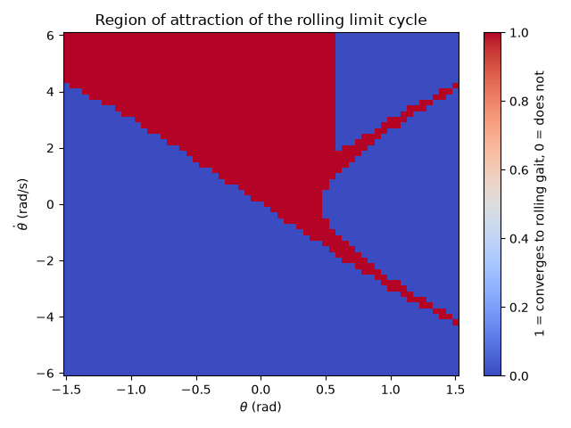
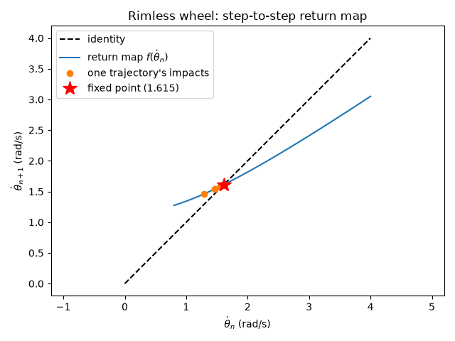
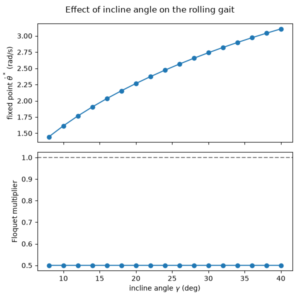
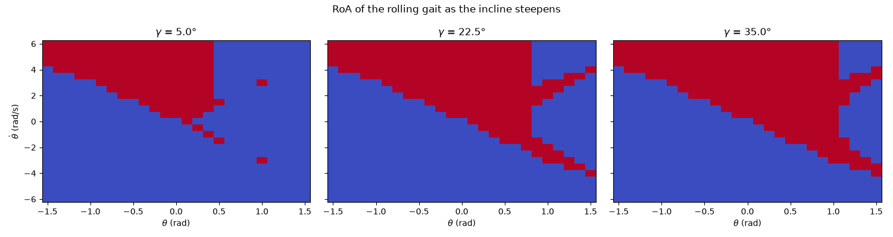
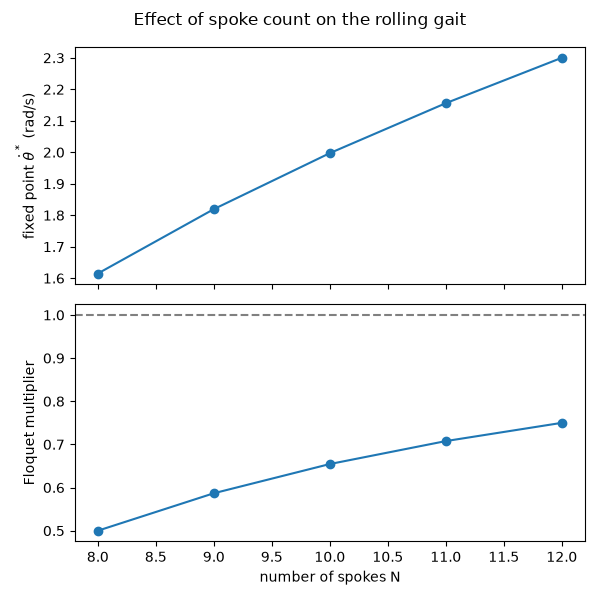
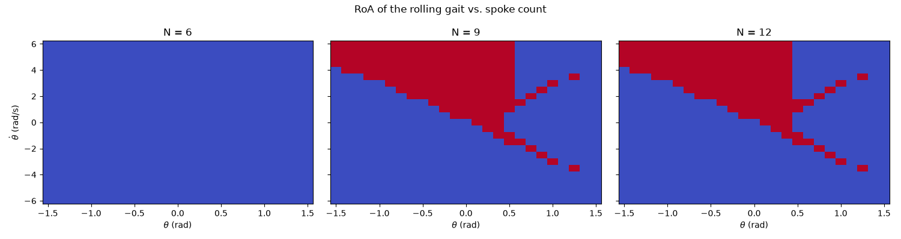

# Assignment 1: Rimless Wheel

## Running the code


```console
uv run assignment_1_sanity_check.py
uv run assignment_1_regions_of_attraction.py
uv run assignment_1_return_map.py
uv run assignment_1_floquet.py
uv run assignment_1_sweep.py
```

The model itself is in `models/rimless_wheel.py` (dynamics, guard, reset map, and
the hybrid `simulate` function); `integrators.py` provides the RK4 step it's built on.

## Sanity checks

Three checks, in `assignment_1_sanity_check.py`:

**1. Energy conservation within a stance phase.** No damping/actuation between impacts,
so mechanical energy should stay flat. Result: max drift $6\times10^{-14}$ J/kg —
conserved to numerical precision.



**2. Impact energy loss matches theory.** Theory predicts a fixed ratio
$KE^+/KE^- = \cos^2(2\alpha)$ at every impact. Result: with 8 spokes ($\alpha = \pi/8$),
measured ratio is exactly 0.5, matching $\cos^2(\pi/4)$.

**3. Sustained rolling converges to a steady impact speed.** Expected the post-impact
velocity to settle to a constant (the rolling limit cycle). Result: converges to
$\dot\theta^* \approx 1.6148$ rad/s within a handful of impacts.



## Regions of attraction





## Return map and Floquet multiplier





## Effect of incline angle and spoke count

`assignment_1_sweep.py` sweeps both parameters.




Incline angle γ: Steeper slopes make the wheel roll faster because it gains more energy each step. The Floquet multiplier stays about 0.5, so changing the slope does not strongly affect how quickly the system converges. As the slope gets steeper, the rolling region also gets larger.




Number of spokes : More spokes increase the Floquet multiplier, which means the wheel converges more slowly to steady rolling. Fewer spokes cause harder impacts and more energy loss, so the wheel converges faster.

At a 10° incline, N = 6 and N = 7 do not sustain rolling, while N = 8–12 do. With fewer spokes, the angle between spokes is larger, so the wheel needs more energy to move over each step.